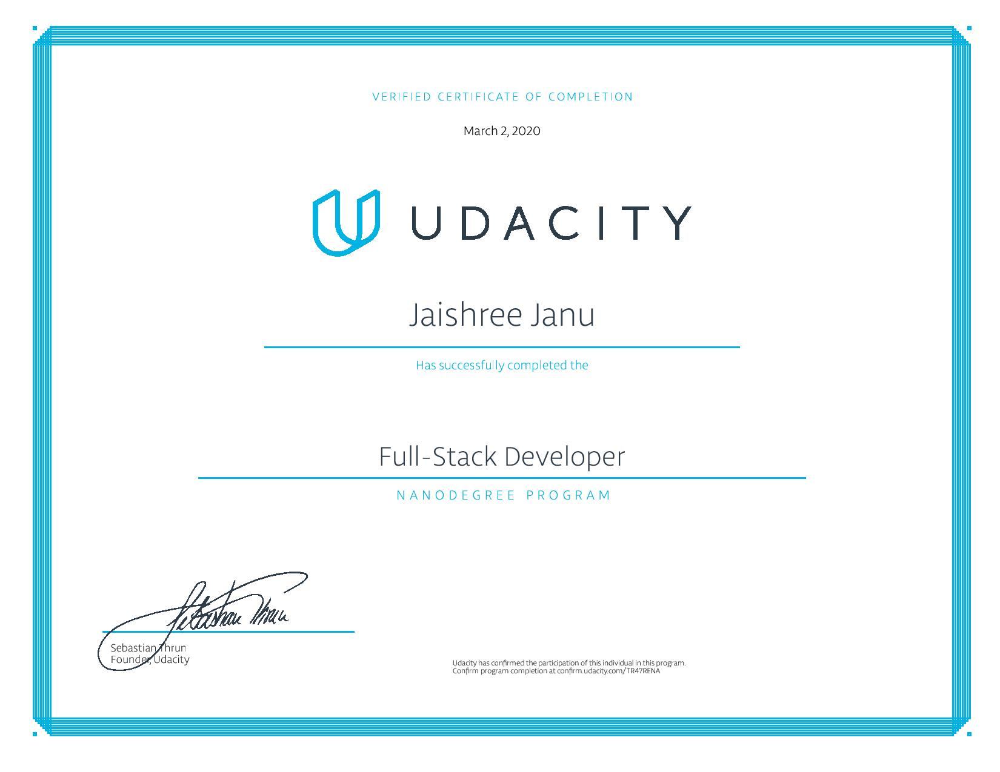

# Full-Stack Developer Nanodegree Program

The motivation behind taking this course is to learn following skills and topics:
1. SQL and Data Modeling for the web
2. API Development and Documentation
3. Identity and Access Management
4. Server Deployment, Containerization and Testing

All the above mentioned skills are helpful in developing a full-fledged web application.

## Details of the course

This course takes you through the web development in the world of python. I learnt libraries and languages required for web development in python.
As a result, I have acquired huge amount of knowledge in following areas:

- Databases: **Postgresql**, **SQLAlchemy ORM**
- API development: **Flask**, **Python3** (server language and server framework)
- Schema migrations: **Flask-Migrate**
- To handle cross origin requests: **Flask-CORS**
- Third-party authentication: **Auth0**
- Authentication and Authorization
- Javascript object signing and encryption of JWTs: **jose**
- TDD and writing tests: **unittest**
- Containerization and deployment: **docker** and **kubernetes**
- Documenting API endpoints

## Project details

During the coursework, following projects were developed.

1. **Fyyur: Artist Booking Site**

- Implement data models in relational, normalized form. Relationship between models correctly defined.
- Connect models to database.
- Demonstrate a good grasp of SQLAlchemy.
- Demonstrate the ability to construct a well-organized code base.
- Following api endpoints should work : list venues, list artists, show venue details, show artist details, post a new venue,
post a new artist(cannot submit invalid form submission), create a show, list all upcoming shows, list all past shows, search venues, search artists.
- **Frontend**: ** HTML, CSS, Bootstrap **

Installation, development setup, documentation and source code can seen here: [project link](https://github.com/JaishreeJanu/Udacity-full-stack-developer-program/tree/master/fyyur-music-venue-booking-site)

2. **trivia-api**

- Handling HTTP request.
- Writing API endpoints and interacting with database.
- Utilize multiple HTTP request methods.
- Handle common errors.
- Use unittest to test flask application for expected behaviour and validate API endpoints
- **Frontend**: ** Reactjs **
Development setup, API documentation and code can seen here: [project link](https://github.com/JaishreeJanu/Udacity-full-stack-developer-program/tree/master/trivia_api/starter)

3. **Coffee shop app**

- The project demonstrates an understanding of restful APIs
- Secure a REST API for applications
- Understanding third-party authentication system
- Understanding JWTs and Role based Authentication
- The code adheres to [PEP 8 style guide](https://www.python.org/dev/peps/pep-0008/) and follows common best practices.
- **Frontend**: ** HTML, CSS, Bootstrap **

Development setup, API documentation and code can seen here: [project link](https://github.com/JaishreeJanu/Udacity-full-stack-developer-program/tree/master/coffee_shop/starter_code)

4. **Deploying flask app on kubernetes**

- Containerize and run app locally.
- Create EKS cluster and IAM role.
- Deployment to kubernetes using CodePipeline and CodeBuild.
- Adding tests to the build.

Source code for this projects can be seen here: [project link](https://github.com/JaishreeJanu/deployment-on-kubernetes)

5. **Capstone project: Casting Agency**

- This is the final project of this course which tests all the skills learnt till now.
- Architect relational database models in python.
- Utilize SQLAlchemy to conduct database queries
- Follow RESTful principles of API development.
- Enable Role Based Authentication and roles-based access control (RBAC) in a Flask application
- Demonstrate validity of API behavior
- Application is hosted live at heroku: [live application](https://final-capstone-udacity.herokuapp.com/actors) 
- The application has been documented well. The code adheres to PEP 8 style guide.

Development setup, documentation and source code of this application can be seen here: [project link](https://github.com/JaishreeJanu/Udacity-full-stack-developer-program/tree/master/capstone%20project)

The certificate for udacity nanodegree program can be seen here: [certificate link](https://confirm.udacity.com/TR47RENA)

